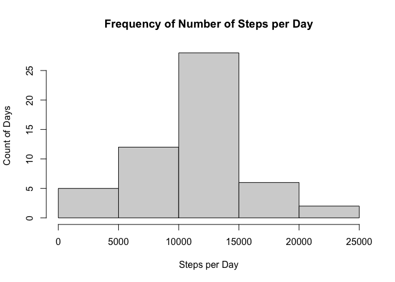

## Loading and preprocessing the data
Begin by reading in the csv file and view the first couple lines of the data.

```r
activity<-read.csv("activity.csv")
head(activity)
```

```
##   steps       date interval
## 1    NA 2012-10-01        0
## 2    NA 2012-10-01        5
## 3    NA 2012-10-01       10
## 4    NA 2012-10-01       15
## 5    NA 2012-10-01       20
## 6    NA 2012-10-01       25
```
Convert the date column to the Date data type. 

```r
activity$date<-as.Date(activity$date)
```

## What is mean total number of steps taken per day?
Calculate the number of steps taken per day and display in a histogram:

```r
stepsPerDay<-aggregate(activity["steps"],by=activity["date"],sum)
hist(stepsPerDay$steps, main="Frequency of Number of Steps per Day",xlab="Steps per Day",ylab="Count of Days")
```

<!-- -->

The mean number of steps taken in a day is given by

```r
mean(stepsPerDay$steps,na.rm=TRUE)
```

```
## [1] 10766.19
```
and the median number of steps taken in day is given by

```r
median(stepsPerDay$steps,na.rm=TRUE)
```

```
## [1] 10765
```


## What is the average daily activity pattern?
Calculate the average number of steps taken at each time interval across all days:

```r
stepsPerInterval<-aggregate(activity["steps"],by=activity["interval"],mean,na.rm=TRUE)
```

Create a time series plot based on the average steps per each time interval:


```r
plot(stepsPerInterval$interval,stepsPerInterval$steps,type="l",ylab="Number of Steps",xlab="Time Interval",main="Average Steps Per Time Interval")
```

<!-- -->

Get the interval with the maximal number of average steps:

```r
stepsPerInterval[which.max(stepsPerInterval$steps),"interval"]
```

```
## [1] 835
```


## Imputing missing values
The total number of rows with missing values is:

```r
sum(!complete.cases(activity))
```

```
## [1] 2304
```

Fill in the missing values using the mean number of steps taken for the given interval. Note that the package dplyr must be installed.

```r
library(dplyr)
```

```
## 
## Attaching package: 'dplyr'
```

```
## The following objects are masked from 'package:stats':
## 
##     filter, lag
```

```
## The following objects are masked from 'package:base':
## 
##     intersect, setdiff, setequal, union
```

```r
completeActivity<-data.frame(activity)

completeActivity$steps <- with(completeActivity, ave(steps, interval,
    FUN = function(x) replace(x, is.na(x), mean(x, na.rm = TRUE))))
```


```r
completeStepsPerDay<-aggregate(completeActivity["steps"],by=completeActivity["date"],sum)
hist(completeStepsPerDay$steps, main="Frequency of Number of Steps per Day",xlab="Steps per Day",ylab="Count of Days")
```

<!-- -->

The new mean number of steps per day is

```r
mean(completeStepsPerDay$steps)
```

```
## [1] 10766.19
```
and the new median number of steps per day is

```r
median(completeStepsPerDay$steps)
```

```
## [1] 10766.19
```
While the mean stays the same, the median shifts slightly with the na's removed.

## Are there differences in activity patterns between weekdays and weekends?
